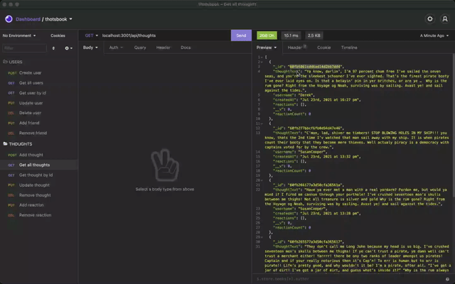
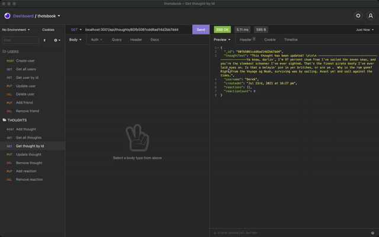

# Thotsbook

## Description
This project is an API for a social network web app where users can share their thoughts, react to friends's thoughts, and create a friends list.

[**CHECK THE WALKTHROUGH VIDEOS HERE**](#walkthrough-video)

## Table of contents
- [Thotsbook](#thotsbook)
  - [Description](#description)
  - [Table of contents](#table-of-contents)
  - [API end points](#api-end-points)
    - [/api/users](#apiusers)
      - [Create a user (POST /api/users/)](#create-a-user-post-apiusers)
      - [Get all users (GET /api/users/)](#get-all-users-get-apiusers)
      - [Get user by id (GET /api/users/:userId)](#get-user-by-id-get-apiusersuserid)
      - [Update user (PUT /api/users/:userId)](#update-user-put-apiusersuserid)
      - [Delete user (DELETE /api/users/:userId)](#delete-user-delete-apiusersuserid)
      - [Add a friend (PUT /api/users/:userId/friends)](#add-a-friend-put-apiusersuseridfriends)
      - [Remove a friend (DELETE /api/users/:userId/friends/friendId)](#remove-a-friend-delete-apiusersuseridfriendsfriendid)
    - [/api/thoughts](#apithoughts)
      - [Add a thought (POST /api/thoughts/)](#add-a-thought-post-apithoughts)
      - [Get all thoughts (GET /api/thoughts/)](#get-all-thoughts-get-apithoughts)
      - [Get a thought by id (GET /api/thoughts/:thoughtId)](#get-a-thought-by-id-get-apithoughtsthoughtid)
      - [Update a thought (PUT /api/thoughts/:thoughtId)](#update-a-thought-put-apithoughtsthoughtid)
      - [Remove a thought (DELETE /api/thoughts/:thoughtId)](#remove-a-thought-delete-apithoughtsthoughtid)
      - [Add a reaction to a thought (PUT /api/thoughts/:thoughtId/reactions)](#add-a-reaction-to-a-thought-put-apithoughtsthoughtidreactions)
      - [Remove a reaction to a thought (DELETE /api/thoughts/:thoughtId/reactions/:reactionId)](#remove-a-reaction-to-a-thought-delete-apithoughtsthoughtidreactionsreactionid)
  - [Models](#models)
    - [User](#user)
    - [Thought](#thought)
    - [Reaction](#reaction)
  - [Controller](#controller)
    - [Creating a user document](#creating-a-user-document)
    - [Retrieval of user document(s)](#retrieval-of-user-documents)
    - [Update User](#update-user)
    - [Delete User](#delete-user)
  - [Walkthrough videos](#walkthrough-videos)
  - [Questions and contact](#questions-and-contact)

## API end points

### /api/users
The following endpoints are available to perform CRUD operations on Users.

#### Create a user (POST /api/users/)
Body:
```
{
    "username"	: "SpencerReid",
	"email"		: "sreidfbi@gmail.com"
}
```
Responses:

200 OK - Successful creation
```
{
    "thoughts"    : [],
    "friends"     : [],
    "_id"         : "60fb4aacb6507f13dabc9146",
    "username"    : "SpencerReid",
    "email"       : "sreidfbi@gmail.com",
    "__v"         : 0,
    "friendCount" : 0,
    "thoughtCount": 0
}
```

400 Error - Error occurred preventing user creation
```
{
    "error" : "<error message>" 
}
```

#### Get all users (GET /api/users/)
Body:
```
None
```
Responses:

200 OK - Successful retrieval
```
[
  {
    "thoughts": [],
    "friends": [],
    "_id": "60fb4a13b6507f13dabc9143",
    "username": "Derek",
    "email": "dwilson@gmail.com",
    "friendCount": 0,
    "thoughtCount": 0
  },
  {
    "thoughts": [
      "60fb253110977e0ccd6c2e10",
      "60fb265577a3d50cfa365617",
      "60fb266177a3d50cfa36561a",
      "60fb277bbcf6fb0d94d47e46"
    ],
    "friends": [
      "60f7a90c9c338e154cf3e4d9",
      "60fb2c2a1c26d40f44b3131f"
    ],
    "_id": "60f7a9b79c338e154cf3e4de",
    "username": "SusanCooper",
    "email": "scooper@gmail.com",
    "friendCount": 2,
    "thoughtCount": 4
  }
  ...
]
```

400 Error - Error occurred preventing user retrieval
```
{
    "error" : "<error message>" 
}
```

#### Get user by id (GET /api/users/:userId)
Body:
```
None (Only user Id on URL)
```

Responses:

200 OK - Successful retrieval
```
{
  "thoughts": [
    {
      "_id": "60fb5061cdd6ad14d2bb7dd4",
      "thoughtText": "Ya know, darlin’, I’m 97 percent chum free I’ve sailed the seven seas, and you’re the sleekest schooner I’ve ever sighted. That’s the finest pirate booty I’ve ever laid eyes on. Is that a belayin’ pin in yer britches, or are ye …  Why is the rum gone? Right from the Voyage og Noah, surviving was by sailing. Avast ye! and sail against the tides.",
      "username": "Derek",
      "createdAt": "Jul 23rd, 2021 at 16:27 pm",
      "reactions": [],
      "reactionCount": 0
    }
  ],
  "friends": [
    {
      "thoughts": [],
      "friends": [],
      "_id": "60fb4915b6507f13dabc9140",
      "username": "JasonGideon",
      "email": "jgideonfbi@gmail.com",
      "friendCount": 0,
      "thoughtCount": 0
    }
  ],
  "_id": "60fb4a13b6507f13dabc9143",
  "username": "Derek",
  "email": "dwilson@gmail.com",
  "friendCount": 1,
  "thoughtCount": 1
}
```

400 Error - Error occurred preventing user retrieval
```
{
    "error" : "<error message>" 
}
```


#### Update user (PUT /api/users/:userId)
Body:
```
{
	"username"	: "SpencerReid33",
	"email"			: "sreidfbi-bau@gmail.com"
}

Plus userId on URL
```

Responses:

200 OK - Successful update returns new updated document
```
{
  "thoughts": [],
  "friends": [],
  "_id": "60fb4aacb6507f13dabc9146",
  "username": "SpencerReid33",
  "email": "sreidfbi-bau@gmail.com",
  "__v": 0,
  "friendCount": 0,
  "thoughtCount": 0
}
```

400 Error - Error occurred preventing user retrieval
```
{
    "error" : "<error message>" 
}
```

404 - No user found
```
{
  "message": "No user found with this id"
}
```


#### Delete user (DELETE /api/users/:userId)
Body:
```
None (Only user Id on URL)
```

Responses:
200 OK - Successful delete returns deleted document
```
{
  "thoughts": [],
  "friends": [],
  "_id": "60fb4aacb6507f13dabc9146",
  "username": "SpencerReid33",
  "email": "sreidfbi-bau@gmail.com",
  "__v": 0,
  "friendCount": 0,
  "thoughtCount": 0
}
```

400 Error - Error occurred preventing user retrieval
```
{
    "error" : "<error message>" 
}
```

404 - No user found
```
{
  "message": "No user found with this id"
}
```


#### Add a friend (PUT /api/users/:userId/friends)
Body:
```
{
	"friendId" : "60fb2c2a1c26d40f44b3131f"
}
```

Responses:

200 OK - Successfull friend addition returns updated User document

```
{
  "thoughts": [],
  "friends": [
    "60fb4915b6507f13dabc9140",
    "60fb2c2a1c26d40f44b3131f"
  ],
  "_id": "60fb4a13b6507f13dabc9143",
  "username": "Derek",
  "email": "dwilson@gmail.com",
  "__v": 0,
  "friendCount": 2,
  "thoughtCount": 0
}
```

400 Error - Error occurred preventing user retrieval
```
{
    "error" : "<error message>" 
}
```

404 - No user found
```
{
  "message": "No user found with this id"
}
```


#### Remove a friend (DELETE /api/users/:userId/friends/friendId)
Body:
```
None (Only user Id and friend Id on URL)
```

Responses:

200 OK - Successful friend removal returns updated User document
```
{
  "thoughts": [],
  "friends": [
    "60fb4915b6507f13dabc9140"
  ],
  "_id": "60fb4a13b6507f13dabc9143",
  "username": "Derek",
  "email": "dwilson@gmail.com",
  "__v": 0,
  "friendCount": 1,
  "thoughtCount": 0
}
```

400 Error - Error occurred preventing user retrieval
```
{
    "error" : "<error message>" 
}
```

404 - No user found
```
{
  "message": "No user found with this id"
}
```


### /api/thoughts
The following endpoints are avilable to perform CRUD operations on Thoughs. Including two additional endpoints for adding and removing reactions to thoughts. Yes - I completely missed the opportunity to name the endpoint *thots* but meh - I was in too deep when I realized.

#### Add a thought (POST /api/thoughts/)
Body:
```
{
	"thoughtText"   : "Ya know, darlin’, I’m 97 percent chum free I’ve sailed the seven seas, 
                       and you’re the sleekest schooner I’ve ever sighted.",
	"username"      : "Derek"
}
```

Responses:

200 OK - Successful thought creation returns updated user document
```
{
  "thoughts": [
    "60fb5061cdd6ad14d2bb7dd4"
  ],
  "friends": [
    "60fb4915b6507f13dabc9140"
  ],
  "_id": "60fb4a13b6507f13dabc9143",
  "username": "Derek",
  "email": "dwilson@gmail.com",
  "__v": 0,
  "friendCount": 1,
  "thoughtCount": 1
}
```
400 Error - Error occurred preventing adding thought
```
{
    "error" : "<error message>" 
}
```


#### Get all thoughts (GET /api/thoughts/)
Body:
```
None
```

Responses:

200 OK - Successful retrieval returns thoughts and reactions
```
[
  {
    "_id": "60fb277bbcf6fb0d94d47e46",
    "thoughtText": "C’mon, lad, shiver me timbers! STOP BLOWING HOLES IN MY SHIP!!! you know, thats the 2nd time I’v watched that man sail away with my ship. It is when pirates count their booty that they become mere thieves. Well actualy piracy is a democracy with captains voted for by the crew.",
    "username": "SusanCooper",
    "createdAt": "Jul 23rd, 2021 at 13:32 pm",
    "reactions": [],
    "__v": 0,
    "reactionCount": 0
  },
  {
    "_id": "60fb266177a3d50cfa36561a",
    "thoughtText": "Have ya ever met a man with a real yardarm? Pardon me, but would ya mind if I fired me cannon through your porthole? I’ve crushed seventeen men’s skulls between me thighs! Not all treasure is silver and gold Why is the rum gone? Right from the Voyage og Noah, surviving was by sailing. Avast ye! and sail against the tides.",
    "username": "SusanCooper",
    "createdAt": "Jul 23rd, 2021 at 13:28 pm",
    "reactions": [],
    "__v": 0,
    "reactionCount": 0
  },
  {
    "_id": "60fb265577a3d50cfa365617",
    "thoughtText": "They don’t call me Long John because my head is so big. I’ve crushed seventeen men’s skulls between me thighs! If ye can’t trust a pirate, ye damn well can’t trust a merchant either! Yarrrr! there be ony two ranks of leader amongst us pirates! Captain and if your really notorious then it’s Cap’n! To err is human but to arr is pirate!! Life’s pretty good, and why wouldn’t it be? I’m a pirate, after all. “I’ve got a jar of dirt! I’ve got a jar of dirt, and guess what’s inside it?” “Why is the rum always gone?” Work like a captain, play like a pirate. Ahoy! lets trouble the water!",
    "username": "SusanCooper",
    "createdAt": "Jul 23rd, 2021 at 13:28 pm",
    "reactions": [
      {
        "_id": "60fb3ba091c3d011b1159815",
        "reactionBody": "Gurl, you trippin...",
        "username": "ElleGreenwood",
        "reactionId": "60fb3ba091c3d011b1159816",
        "createdAt": "Jul 23rd, 2021 at 14:58 pm"
      },
      {
        "_id": "60fb3c1a91c3d011b1159818",
        "reactionBody": "Whatever drugs you're on, I want some! LOL",
        "username": "BradleyFine",
        "reactionId": "60fb3c1a91c3d011b1159819",
        "createdAt": "Jul 23rd, 2021 at 15:0 pm"
      }
    ],
    "__v": 0,
    "reactionCount": 2
  }
]
```

400 Error - Error occurred preventing adding thought
```
{
    "error" : "<error message>" 
}
```


#### Get a thought by id (GET /api/thoughts/:thoughtId)
Body:
```
None (Only thought Id on URL)
```

Responses:

200 OK - Full thought with reactions
```
{
  "_id": "60fb265577a3d50cfa365617",
  "thoughtText": "They don’t call me Long John because my head is so big. I’ve crushed seventeen men’s skulls between me thighs! If ye can’t trust a pirate, ye damn well can’t trust a merchant either! Yarrrr! there be ony two ranks of leader amongst us pirates! Captain and if your really notorious then it’s Cap’n! To err is human but to arr is pirate!! Life’s pretty good, and why wouldn’t it be? I’m a pirate, after all. “I’ve got a jar of dirt! I’ve got a jar of dirt, and guess what’s inside it?” “Why is the rum always gone?” Work like a captain, play like a pirate. Ahoy! lets trouble the water!",
  "username": "SusanCooper",
  "createdAt": "Jul 23rd, 2021 at 13:28 pm",
  "reactions": [
    {
      "_id": "60fb3ba091c3d011b1159815",
      "reactionBody": "Gurl, you trippin...",
      "username": "ElleGreenwood",
      "reactionId": "60fb3ba091c3d011b1159816",
      "createdAt": "Jul 23rd, 2021 at 14:58 pm"
    },
    {
      "_id": "60fb3c1a91c3d011b1159818",
      "reactionBody": "Whatever drugs you're on, I want some! LOL",
      "username": "BradleyFine",
      "reactionId": "60fb3c1a91c3d011b1159819",
      "createdAt": "Jul 23rd, 2021 at 15:0 pm"
    }
  ],
  "reactionCount": 2
}
```
400 Error - Error occurred preventing adding thought
```
{
    "error" : "<error message>" 
}
```



#### Update a thought (PUT /api/thoughts/:thoughtId)
Body:
```
{
	"thoughtText" : "This thought has been updated! \n\n\n -------------------------------------------------Ya know, darlin’, I’m 97 percent chum free I’ve sailed the seven seas, and you’re the sleekest schooner I’ve ever sighted. That’s the finest pirate booty I’ve ever laid eyes on. Is that a belayin’ pin in yer britches, or are ye …  Why is the rum gone? Right from the Voyage og Noah, surviving was by sailing. Avast ye! and sail against the tides.",
	"username" : "Derek"
}
```

Responses:

200 OK - Returns updated thought, including reactions
```
{
  "_id": "60fb5061cdd6ad14d2bb7dd4",
  "thoughtText": "This thought has been updated! \n\n\n -------------------------------------------------Ya know, darlin’, I’m 97 percent chum free I’ve sailed the seven seas, and you’re the sleekest schooner I’ve ever sighted. That’s the finest pirate booty I’ve ever laid eyes on. Is that a belayin’ pin in yer britches, or are ye …  Why is the rum gone? Right from the Voyage og Noah, surviving was by sailing. Avast ye! and sail against the tides.",
  "username": "Derek",
  "createdAt": "Jul 23rd, 2021 at 16:27 pm",
  "reactions": [],
  "__v": 0,
  "reactionCount": 0
}
```
400 Error - Error occurred preventing user retrieval
```
{
    "error" : "<error message>" 
}
```

404 - No thought found
```
{
  "message": "No thought found with this id"
}
```


#### Remove a thought (DELETE /api/thoughts/:thoughtId)
Body:
```
None (Only thought Id on URL) 
```

Responses:

200 OK - Returns user document with updated thoughts
```
{
  "thoughts": [],
  "friends": [
    "60fb4915b6507f13dabc9140"
  ],
  "_id": "60fb4a13b6507f13dabc9143",
  "username": "Derek",
  "email": "dwilson@gmail.com",
  "__v": 0,
  "friendCount": 1,
  "thoughtCount": 0
}
```

400 Error - Error occurred preventing user retrieval
```
{
    "error" : "<error message>" 
}
```

404 - No thought found
```
{
  "message": "No thought found with this id, nothing to remove"
}
```

404 - No user found (to update the user document)
```
{
  "message": "No user found with this id"
}
```




#### Add a reaction to a thought (PUT /api/thoughts/:thoughtId/reactions)
Body:
```
{
	"reactionBody"  : "We need to talk about THAT dress hon... Prom was decades ago",
	"username"      : "Rayna"
}
```

Responses:

200 OK - Returns updated thought with all reactions, including newly added
```
{
  "_id": "60fb265577a3d50cfa365617",
  "thoughtText": "They don’t call me Long John because my head is so big. I’ve crushed seventeen men’s skulls between me thighs! If ye can’t trust a pirate, ye damn well can’t trust a merchant either! Yarrrr! there be ony two ranks of leader amongst us pirates! Captain and if your really notorious then it’s Cap’n! To err is human but to arr is pirate!! Life’s pretty good, and why wouldn’t it be? I’m a pirate, after all. “I’ve got a jar of dirt! I’ve got a jar of dirt, and guess what’s inside it?” “Why is the rum always gone?” Work like a captain, play like a pirate. Ahoy! lets trouble the water!",
  "username": "SusanCooper",
  "createdAt": "Jul 23rd, 2021 at 13:28 pm",
  "reactions": [
    {
      "_id": "60fb3ba091c3d011b1159815",
      "reactionBody": "Gurl, you trippin...",
      "username": "ElleGreenwood",
      "reactionId": "60fb3ba091c3d011b1159816",
      "createdAt": "Jul 23rd, 2021 at 14:58 pm"
    },
    {
      "_id": "60fb3c1a91c3d011b1159818",
      "reactionBody": "Whatever drugs you're on, I want some! LOL",
      "username": "BradleyFine",
      "reactionId": "60fb3c1a91c3d011b1159819",
      "createdAt": "Jul 23rd, 2021 at 15:0 pm"
    },
    {
      "_id": "60fb5488cdd6ad14d2bb7de9",
      "reactionBody": "We need to talk about THAT dress hon... Prom was decades ago",
      "username": "Rayna",
      "reactionId": "60fb5488cdd6ad14d2bb7dea",
      "createdAt": "Jul 23rd, 2021 at 16:45 pm"
    }
  ],
  "__v": 0,
  "reactionCount": 3
}
```

400 Error - Error occurred preventing user retrieval
```
{
    "error" : "<error message>" 
}
```

404 - No thought found
```
{
  "message": "No thought found with this id, cannot add reaction"
}
```


#### Remove a reaction to a thought (DELETE /api/thoughts/:thoughtId/reactions/:reactionId)
Body:
```
None (Only thought and reaction Ids on URL) 
```

Responses:

200 OK - Returns updated thought with updated reactions array
```
{
  "_id": "60fb265577a3d50cfa365617",
  "thoughtText": "They don’t call me Long John because my head is so big. I’ve crushed seventeen men’s skulls between me thighs! If ye can’t trust a pirate, ye damn well can’t trust a merchant either! Yarrrr! there be ony two ranks of leader amongst us pirates! Captain and if your really notorious then it’s Cap’n! To err is human but to arr is pirate!! Life’s pretty good, and why wouldn’t it be? I’m a pirate, after all. “I’ve got a jar of dirt! I’ve got a jar of dirt, and guess what’s inside it?” “Why is the rum always gone?” Work like a captain, play like a pirate. Ahoy! lets trouble the water!",
  "username": "SusanCooper",
  "createdAt": "Jul 23rd, 2021 at 13:28 pm",
  "reactions": [
    {
      "_id": "60fb3ba091c3d011b1159815",
      "reactionBody": "Gurl, you trippin...",
      "username": "ElleGreenwood",
      "reactionId": "60fb3ba091c3d011b1159816",
      "createdAt": "Jul 23rd, 2021 at 14:58 pm"
    },
    {
      "_id": "60fb3c1a91c3d011b1159818",
      "reactionBody": "Whatever drugs you're on, I want some! LOL",
      "username": "BradleyFine",
      "reactionId": "60fb3c1a91c3d011b1159819",
      "createdAt": "Jul 23rd, 2021 at 15:0 pm"
    }
  ],
  "__v": 0,
  "reactionCount": 2
}
```

400 Error - Error occurred preventing user retrieval
```
{
    "error" : "<error message>" 
}
```

404 - No thought found
```
{
  "message": "No thought found with this id, cannot add reaction"
}
```

## Models

### User
Required fields include **username** and **email**. Thoughts are subdocuments to *User*, therefore they are referenced in an array of _Thought_.

```
const UserSchema = new Schema(
    {
        username: {
            type: String,
            unique: [ true, 'This username is not available' ],
            required: [ true, 'Username is required'],
            trim: true
        },
        email: {
            type: String,
            unique: [ true, 'This e-mail is already registered' ],
            required: [ true, 'E-mail is required' ],
            trim: true,
            match: [/^([\w-\.]+@([\w-]+\.)+[\w-]{2,4})?$/]
        },
        thoughts: [
            {
                type: Schema.Types.ObjectId,
                ref: 'Thought'
            }
        ],
        friends: [
            {
                type: Schema.Types.ObjectId,
                ref: 'User'
            }
        ]
    },
    {
        toJSON: {
            virtuals: true, // for friendCount and thoughtCount virtuals
            getters: true
        },
        id: false
    }
);
```

The number of friends and thoughts for a given user are represented using **virtuals**, these are auto-calculated:

```
UserSchema.virtual('friendCount').get(
    function() {
        return this.friends.length;
    }
);

UserSchema.virtual('thoughtCount').get(
    function() {
        return this.thoughts.length;
    }
);
```

A custom message is displayed when trying to create a user with a username that is already in the database, since the **unique** option does not work like **required** to show a custom message, we need this method:
```
UserSchema.post('save', function (error, doc, next) {
    if (error.name === 'MongoError' && error.code === 11000) {
        next (new Error('Username already exists'));
    } else {
        next();
    }
});
```
The function above will return an error with a custom message when the code is 11000 (document key already exists in database).


### Thought
Required fields for this model are **thoughtText** and **username**, validation messages are included for these two properties.

```
const ThoughtSchema = new Schema(
    {
        thoughtText: {
            type: String,
            required: [ true, 'The thought text is mandatory' ],
            min: 1,
            max: [ 128, 'Thoughts must have a maximum of 128 characters' ]
        },
        createdAt: {
            type: Date,
            default: Date.now,
            get: (createdAtVal) => dateFormat(createdAtVal)
        },
        username: {
            type: String,
            required: [ true, 'Username is required']
        },
        reactions: [ReactionSchema]
    },
    {
        toJSON: {
            virtuals: true,
            getters: true
        },
        id: false
    }
);
```

The number of reactions to a thought is calculated using a virtual:
```
ThoughtSchema.virtual('reactionCount').get(
    function() {
        return this.reactions.length;
    }
);
```

### Reaction
This is not a model, it is an additional schema within Thought. At its most basic level, a reaction is simply another thought, in response to an original thought. This is why we're adding them within the same Model.

```
const ReactionSchema = new Schema(
    {
        reactionId: {
            type: Schema.Types.ObjectId,
            default: () => new Types.ObjectId()
        },
        reactionBody: {
            type: String,
            required: [ true, 'Request body is missing' ],
            trim: true,
            max: [ 280, 'Reactions must have a maximum of 280 characters' ]
        },
        username: {
            type: String,
            required: [ true, 'Username is required' ]
        },
        createdAt: {
            type: Date,
            default: Date.now,
            get: (createdAtVal) => dateFormat(createdAtVal)
        }
    },
    {
        toJSON: {
            virtuals: true,
            getters: true
        },
        id: false
    }
);
```

Reactions do not have additional reactions to them. No more subdocuments are needed for them, like we did for Thoughts.

## Controller
For practical purposes, I'm only describing the code implemented on the user controller. The thoughts controller is very similar and it has been coded in the same fashion. In other words: please look at the code directly.

### Creating a user document
Through the User model, simply use the _**.create()**_ method using the request body as a parameter. 
```
createUser({body}, res) {
    User.create(body)
        .then(dbUserData => res.json(dbUserData))
        .catch(err => res.status(400).json(err));
}
```
**Note:** because of Mongoose's flexibility, additional properties like first name, last name, etc. could be added (albeit additional validators would be required).

### Retrieval of user document(s)
Through User, I'm using _**.find({})**_ to retrieve *all users*, and _**.findOne({\_id: params.id})**_ to retrieve a *specific thought* by id.

*Retrieve all*
```
getAllUsers(req, res) {
    User.find({})
        .select('-__v')
        .sort({_id: -1})
        .then(dbUserData => res.json(dbUserData))
        .catch(err => res.status(400).json({message: err.message}));
}
```
**Note:** the following Mongoose methods are being used on top of *.find()*:

* _**.select('-__v')**_ - instructs Mongoose to **not** return the versioning field: **__v**.
* _**.sort({_id: -1})**_ - sorts the results by ID in descendent order, putting the most recently created user at the top.

*Retrieve user by ID*
```
getUserById({params}, res) {
    User.findOne({_id: params.id})
        .populate({
            path: 'thoughts',
            select: '-__v'
        })
        .populate({
            path: 'friends',
            select: '-__v'
        })
        .select('-__v')
        .then(dbUserData => {
            if (!dbUserData) {
                res.status(404).json({message: 'No user found with that id'});
                return;
            }
            res.json(dbUserData);
        })
        .catch(err => res.status(400).json({message: err.message}));
}
```

**Note:** the following Mongoose methods are being used on top of *.find()*:

* _**.populate()**_ - used twice, to instruct Mongoose to retrive *thoughts* and *friends* related to this user. The subdocuments are added on the *path* parameter, and also using *select* to **not** include the versioning field '__v'.
* _**.select('-__v')**_ - instructs Mongoose to **not** return the versioning field: **__v**.
* _**.sort({_id: -1})**_ - sorts the results by ID in descendent order, putting the most recently created user at the top.

### Update User 
There are three types of updates to the User document: Updating the actual user data, Adding a Friend, and Removing a friend. Additionally an indirect update is done via Thoughts, when thoughts are added or removed, the User document is also updated.

*Update user data*
```
updateUser({params,body}, res) {
    User.findOneAndUpdate(
        {_id: params.id},
        body,
        {new:true, runValidators:true}
        )
        .then(dbUserData => {
            if (!dbUserData) {
                res.status(404).json({message: 'No user found with this id'})
                return;
            }
            res.json(dbUserData);
        })
        .catch(err => res.status(400).json({message: err.message}));
}
```
Using _{new: true}_ will return the updated User document after the operation is complete. Additionally, _{runValidators: true}_ allows validators to run prior to updating, this will return messages like: _Username is required_ if the username is not in the request body, or _This username is not available_ if the username already exists on the data collection (username must be unique, based on the [User](#user) model description)

*Add friends*
```
addFriend({params, body}, res) {
    User.findOneAndUpdate(
        {_id: params.userId},
        {$push: {friends: body.friendId}},
        {new: true, runValidators: true}
    )
    .then(dbUserData => {
        console.log('updating...');
        if (!dbUserData) {
            res.status(404).json({message: "No user found with this id"});
            return;
        }
        res.json(dbUserData);
    })
    .catch(err => res.status(400).json({message: err.message}));
}
```
In this case I'm using *.findOneAndUpdate()* to find the document that needs to be updated. The key portion is Mongoose's method **$push**, which adds the friend document into the *friends* array.

*Remove friends*
```
removeFriend({params}, res) {
    User.findOneAndUpdate(
        {_id: params.userId},
        {$pull: {friends:params.friendId}},
        {new: true, runValidators: true}
    )
    .then(dbUserData => {
        console.log('deleting...');
        if (!dbUserData) {
            res.status(404).json({message: "No user found with this id"});
            return;
        }
        res.json(dbUserData);
    })
    .catch(err => res.status(400).json({message: err.message}));
}
```
Similar to adding a friend, we're using *.findOneAndUpdate()* to find the User document, then we're using **$pull** to take the *friend* subdocument identified by *params.friendId*.

*Update user when creating a thought*

This method is on the Thought controller, due to the nature of effectively creating a *Thought* document, which results on the need of updating the *User* parent document.

First, using *Thought.create()*, the *Thought* document is created and, upon return of the create promise, we find the user identified by *params.userId* and **$push** the thought into the *thoughts* array:
```
addThought({params, body}, res) {
    Thought.create(body)
    .then(({ _id }) => {
        return User.findOneAndUpdate(
            {_id: params.userId},
            {$push: { thoughts: _id}},
            {new: true}
        );
    })
    .then(dbUserData => {
        if (!dbUserData) {
            res.status(404).json({message:'No user found with that id, cannot add thought'});
            return;
        }
        res.json(dbUserData);
    })
    .catch(err => res.status(400).json({message: err.message}));
}
```

*Update user when deleting a thought*
This is another method that is located on the Thought controller. Similar to adding a new thought, we create the Thought document, then find the User document identified by *params.id*. But in this case we **$pull** the thought out of the *thoughts* array.

```
removeThought({params}, res){
    Thought.findOneAndDelete({_id: params.thoughtId})
    .then(deletedThought => {
        if (!deletedThought) {
            res.status(404).json({message: 'No thought found with this id, nothing to remove'});
            return;
        }
        
        return User.findOneAndUpdate(
            {username: deletedThought.username},
            {$pull: {thoughts: params.thoughtId}},
            {new: true}
            )
            .populate({
                path: 'thoughts',
                select: '-__v'
            });
    })
    .then(dbUserData => {
        if (!dbUserData) {
            res.status(404).json({message: 'No user found with this id'});
            return;
        }
        return res.json(dbUserData);
    })
    .catch(err => res.status(400).json({message: err.message}));    
}
```

### Delete User
The method used to delete a user is *.findOneAndDelete()*. This will find the User based on the field and value specified, in this case **{_id: params.id}**. The function deleteUser will return the deleted User document, including the full data of **thoughts** and **friends** via the **.thought()** method.

```
deleteUser({params}, res){
    User.findOneAndDelete(
            {_id: params.id}
        )
        .populate({
            path: 'thoughts',
            select: '-__v'
        })
        .populate({
            path: 'friends',
            select: '-__v'
        })
        .then(dbUserData => {
            if (!dbUserData) {
                res.status(404).json({message: 'No user found with this id'});
                return;
            }
            res.json(dbUserData);
        })
        .catch(err => res.status(400).json({message: err.message}));
}
```

## Walkthrough videos
I'd like to preface the following links by saying that I'm sorry that you have to hear my voice on these videos - but hey - y'all asked for this!

[USER API Walkthrough](https://drive.google.com/file/d/1coFiFDX8yRezspcivHgDhM8JfCweVOkR/view)

[THOUGHTS API Walkthrough](https://drive.google.com/file/d/1AbIt2LJ2fpBKqqRanVR6NznAm5d5kVNc/view)

## Questions and contact
E-mail me: Lou.Arnaut@gmail.com<br>
Check my other doodles: https://github.com/acevezl
